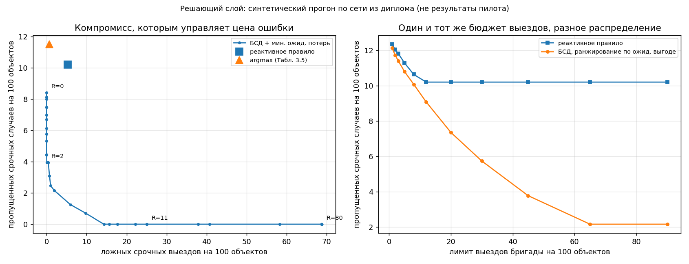
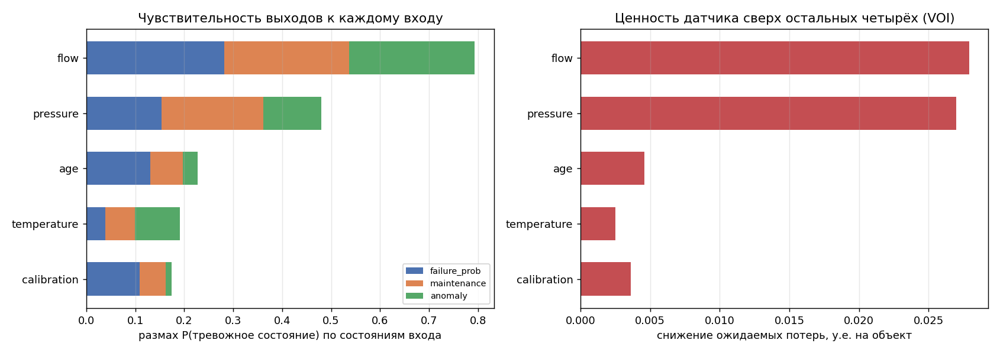
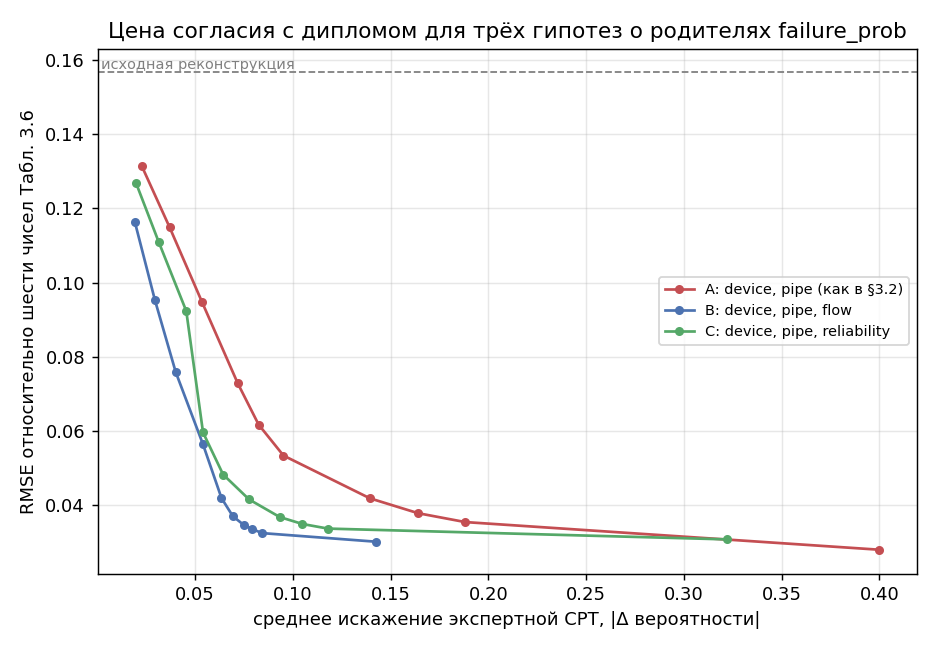
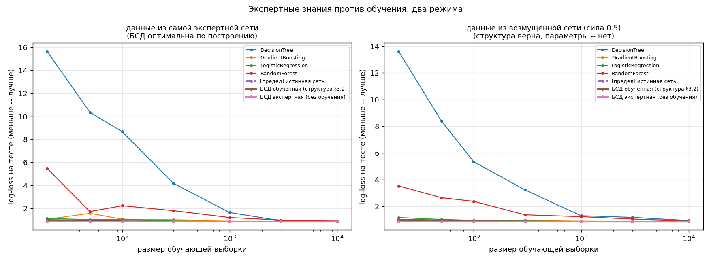

# Байесовская сеть доверия для предиктивного ТО инженерных систем

Python-реализация системы поддержки принятия решений (DSS) на основе
байесовской сети, оригинально разработанной и защищённой как выпускная
квалификационная работа: Поповцев Н.О., «Разработка системы управления
качеством технического обслуживания инженерных систем с использованием
байесовских сетей доверия», СПбГЭУ, 2026 (научный руководитель — к.т.н.,
доцент Л.В. Виноградов).

**Зачем этот репозиторий, если модель уже защищена и работает в HUGIN
Researcher?** Диплом решал задачу управления качеством и был выполнен по
заданию, зафиксировавшему HUGIN как среду реализации. Этот репозиторий —
самостоятельное продолжение той же научной работы: та же сеть, тот же
причинно-следственный граф, но выраженная в виде воспроизводимого,
тестируемого Python-кода, с решающим слоем, анализом чувствительности,
восстановлением структуры по данным и открытым сравнением с ML-подходами.

## Посмотреть за две минуты

Ноутбуки собраны вместе с выполненными выводами и графиками — открываются
прямо на GitHub, запускать ничего не нужно:

| Ноутбук | О чём |
| ------- | ----- |
| [1. Сеть и валидация](notebooks/01_network_and_validation.ipynb) | Структура, сверка с Табл. 3.6, explaining away, чувствительность и ценность информации |
| [2. Решающий слой](notebooks/02_decision_layer.ipynb) | Матрица потерь, разбор одного решения, сравнение стратегий, ограниченная бригада |
| [3. Калибровка](notebooks/03_calibration.ipynb) | Расследование разрыва в сценарии 3 и поиск недостающей дуги |
| [4. Обучение и baselines](notebooks/04_learning_and_baselines.ipynb) | Обучение параметров и структуры, корректное сравнение с ML |

### Главный результат: решение зависит не от порога, а от цены ошибки



Слева: каждая точка синей кривой — своя цена пропущенного отказа. Оба
альтернативных правила лежат **выше** кривой, то есть доминируются: при том
же числе ложных выездов байесовская политика пропускает меньше аварий.
Справа: при одинаковом бюджете выездов ранжирование по ожидаемой выгоде
продолжает снижать пропуски там, где пороговое правило упирается в потолок.

### Что вообще влияет на выводы сети



Температура даёт ровно нулевой отклик по всем трём выходам — канал АИС
опрашивается впустую. Самый ценный вход — давление.

### Разрыв со сценарием 3 объяснён недостающей дугой



Ниже и левее — лучше. Гипотеза с дополнительным родителем у `failure_prob`
доминирует структуру, описанную в §3.2 словами: то же согласие с числами
диплома достигается вдвое меньшим искажением экспертной таблицы.

### Выигрыш даёт граф, а не экспертные вероятности



Правый график: экспертная БСД горизонтальна (параметры неверны), но БСД с
той же структурой и CPT по 20 наблюдениям уже лучше всех моделей без
структуры и быстро выходит на байесовский предел.


## Бизнес-контекст (из диплома)

ООО «Спецмастер» — микропредприятие в Республике Коми, обслуживающее
приборы учёта тепла и воды. Реактивная модель обслуживания («выезд по
жалобе или по превышению порога расхода») давала много ложных выездов и
пропущенные отказы. В ходе производственной практики была развёрнута АИС
на базе ЛЭРС УЧЁТ (32 объекта, ежесуточный опрос, 97.8% успешных сессий),
а поверх неё — аналитический слой на байесовской сети, переводящий
показания приборов в вероятностные оценки риска и рекомендации.

**Результаты пилота (реальные, из диплома, не из этого репозитория):**

| Показатель                    | До      | После        |
| ----------------------------- | ------- | ------------ |
| Ложные выезды, в месяц        | 6–8     | 1–2 (↓ ~75%) |
| Пропущенные отказы, в квартал | 3       | ≤ 1          |
| Время реакции на аномалию     | 24–72 ч | 2–6 ч        |

Как эти числа корректно формулировать: это наблюдения «до/после» без
контрольной группы, на 32 объектах за два месяца, частично ретроспективно
(часть параметров уточнялась на тех же данных, на которых проверялась
модель). Поэтому корректно говорить «после внедрения ложные выезды
снизились с 6–8 до 1–2 в месяц», а не «модель снизила ложные выезды на
75%»: дизайн не позволяет отделить вклад модели от вклада самой АИС и от
эффекта наблюдения. Для строгой оценки нужна проспективная апробация на
полном отопительном сезоне — это и написано в самом дипломе.

## Архитектура сети

Трёхуровневая иерархия «данные → скрытые состояния → управленческие
гипотезы» (см. `src/network_spec.py` — единственный источник истины по
структуре и CPT):

```
Вход (АИС)          Скрытые состояния        Выход (решения)
─────────────       ──────────────────       ─────────────────
давление      ─┐                        ┌─→ вероятность отказа
температура    │                        │
расход        ─┼─→ состояние прибора ────┼─→ необходимость ТО
срок поверки   │   состояние трубопровода│
срок эксплуат.─┘   достоверность показаний┴─→ аномальное потребление
```

11 узлов, 2–3 состояния каждый, 146 свободных параметров (полное
пространство ≈ 79 000 комбинаций — для точного вывода перебором это
тривиально; HUGIN в оригинале использует алгоритм дерева сочленений,
см. §3.1 диплома).

**Известное ограничение: узел `temperature` изолирован.** Температура
объявлена входом в Табл. 3.2, но причинных дуг от неё текст §3.2 не
описывает, поэтому в графе она ни с чем не связана. Это не декларация, а
измеримый факт: `python -m src.sensitivity` показывает размах отклика
0.0000 по всем трём выходам и ценность информации ровно 0, а
`python -m src.structure_learning` независимо подтверждает, что и в данных
связи температуры ни с чем нет. Практический смысл: соответствующий канал
АИС опрашивается впустую, пока дуга не восстановлена. На это есть падающий
тест (`test_temperature_is_inert`) — если он однажды сломается, значит дуга
появилась, и тогда нужно обновить README, а не чинить тест.

## Происхождение чисел (важно для честности перед экспертами)

| Что                                                         | Статус                                                                                                        |
| ----------------------------------------------------------- | ------------------------------------------------------------------------------------------------------------- |
| Структура сети (какой узел от какого зависит)               | Из текста §3.2 диплома                                                                                        |
| CPT `device_cond` (техническое состояние прибора)           | **Точно** Табл. 3.3                                                                                           |
| CPT `pipe_cond` (состояние трубопровода)                    | **Точно** Табл. 3.4                                                                                           |
| CPT `reliability`, `failure_prob`, `maintenance`, `anomaly` | Реконструированы: согласованы с качественной логикой §3.2, валидированы по сценариям Табл. 3.6                |
| Априорные вероятности входных узлов                         | Допущение для симуляции, не из диплома                                                                        |
| Матрица потерь в решающем слое                              | Иллюстративная параметризация, не тарифы предприятия                                                          |
| Реальные данные пилота (32 объекта)                         | Не публикуются (собственность ООО «Спецмастер»); везде далее — синтетика                                      |

Полные CPT из исходного файла HUGIN (`.net`) в тексте диплома не приведены,
поэтому четыре CPT из шести — реконструкция, а не копия оригинала. Она
проверяется скриптом `scripts/verify_reference.py` на трёх диагностических
сценариях из Табл. 3.6.

## Что здесь есть

### 1. Решающий слой — `src/decision.py`

Сеть выдаёт вероятности, но решение «ехать или нет» — это вероятность
**плюс цена ошибки**. Правило Табл. 3.5 (`действие = argmax вероятности`)
неявно предполагает, что пропустить аварию так же плохо, как съездить
зря. Здесь асимметрия сделана явной: `a*(e) = argmin_a Σ_s P(s|e)·L(a,s)`.

Синтетический прогон, на 100 объектов:

| стратегия                          | ложных срочных выездов | пропущено срочных случаев |
| ---------------------------------- | ---------------------- | ------------------------- |
| реактивное правило (порог расхода) | 5.3                    | 10.2                      |
| БСД + argmax (Табл. 3.5)           | 0.7                    | 11.5                      |
| БСД + мин. ожидаемых потерь (R=5)  | 4.3                    | **2.2**                   |

Отдельного внимания стоит средняя строка: правило Табл. 3.5 в лоб
пропускает **больше** срочных случаев, чем даже грубый порог по расходу.
Оно экономит выезды за счёт пропусков, и без матрицы потерь это не видно.

Порог перестаёт быть магической константой: `breakeven_ratio()` показывает,
что для сценария 1 Табл. 3.6 срочный выезд окупается начиная с R ≈ 2.5,
где R — во сколько раз пропущенный отказ дороже выезда. Это та ручка,
которую руководитель предприятия может крутить осознанно.

Плюс `triage()` — ранжирование заявок, когда бригада одна и физически
может сделать только K выездов: реальная задача диспетчера не «ехать или
нет», а «на какие объекты ехать в первую очередь».

### 2. Чувствительность и ценность информации — `src/sensitivity.py`

Три сценария Табл. 3.6 покрывают 3 комбинации входов из 108 и молчат об
остальных 105. Здесь систематическая проверка: торнадо-диаграмма размаха
отклика, взаимная информация вход→выход в битах и ценность информации
(VOI) в единицах ожидаемых потерь — то есть «какой канал АИС стоит своих
денег». Самый ценный вход — давление (0.022 у.е. на объект сверх
остальных четырёх), самый бесполезный — температура (ровно 0).

### 3. Восстановление структуры по данным — `src/structure_learning.py`

Жадный поиск по BIC, чистый numpy (о том, почему не pgmpy, — ниже).
F1 по скелету графа растёт с 0.63 при n=200 до 0.86 при n=5000.

Направленная F1 при этом остаётся низкой, и это не дефект алгоритма: по
наблюдательным данным структура восстановима лишь с точностью до класса
Маркова-эквивалентности — направление дуги, не входящей ни в одну
v-структуру, принципиально неразличимо. Поэтому основная метрика здесь —
скелет, а направленная приводится справочно.

### 4. Калибровка `CPT_FAILURE` и структурная гипотеза — `src/calibration.py`

Реконструированная сеть воспроизводила Табл. 3.6 качественно, но в
сценарии 3 давала P(отказ = высокая) = 0.37 против 0.70 в дипломе.

Разбор чисел диплома: в сценариях 2 и 3 состояние прибора одинаково, а
P(отказ) отличается вдвое (0.52 против 0.70); при этом в сценарии 3
трубопровод *вероятнее* исправен. Значит, разницу нельзя объяснить через
`pipe_cond` — у `failure_prob` есть родитель, которого нет в текстовом
описании структуры §3.2. Проверяются три гипотезы о наборе родителей,
для каждой CPT подбирается минимизацией
`Σ(p_модель − p_диплом)² + λ·||logit − logit_эксперт||²`.

```
                      было     стало
сценарий 3, P(отказ)  0.37     0.65    (диплом 0.70)
RMSE по 6 числам      0.157    0.037
```

Что здесь важно не переоценить: при λ = 0 под шесть чисел подстраивается
**любая** гипотеза, включая исходную структуру, — шесть уравнений против
27–81 параметра, задача недоопределена, и «удалось подогнать» само по себе
ничего не доказывает. Содержательна только *цена* подгонки: исходная
структура достигает согласия, лишь переписав таблицу почти целиком, а
гипотеза с дополнительным родителем даёт то же согласие вдвое дешевле и
доминирует по обеим осям (`reports/figures/calibration_pareto.png`). Между
двумя конкурирующими гипотезами шести чисел не хватает — это решается
данными, а не оптимизацией. Подогнанная таблица **не** подставляется в
`network_spec.py` автоматически: её статус — обоснованная гипотеза о
недостающей дуге, а не восстановленный оригинал.

### 5. Сравнение с ML-моделями — `src/baselines.py`

Первая версия этого сравнения была некорректной, и это стоит сказать
прямо: данные порождались той же сетью, чьё качество измерялось, поэтому
БСД была байесовски-оптимальной **по построению**, а её «точность» 0.686
— не характеристика модели, а байесовский предел задачи.

Исправлено: два режима (данные из экспертной сети и из **возмущённой**
сети, где структура верна, а параметры — нет), метрики — правила скоринга
(log-loss, Brier) вместо accuracy, добавлены логистическая регрессия и
БСД с CPT, обученными по данным.

Log-loss в осмысленном режиме (данные из возмущённой сети, меньше — лучше):

| n\_train | DecisionTree | RandomForest | LogisticReg | GradBoosting | БСД экспертная | БСД обученная | предел |
| -------- | ------------ | ------------ | ----------- | ------------ | -------------- | ------------- | ------ |
| 20       | 9.75         | 2.37         | 1.10        | 1.02         | 0.994          | **0.976**     | 0.947  |
| 100      | 8.97         | 1.43         | 1.02        | 1.01         | 0.994          | **0.969**     | 0.947  |
| 1000     | 1.44         | 1.17         | 0.95        | 0.99         | 0.994          | **0.949**     | 0.947  |
| 3000     | 1.03         | 1.12         | 0.95        | 0.96         | 0.994          | **0.947**     | 0.947  |

Вывод получился **сильнее** исходного. Выигрыш в объёме данных даёт не
экспертная настройка вероятностей, а экспертный причинно-следственный
граф: БСД с той же структурой и CPT, оценёнными всего по 20 наблюдениям,
уже лучше и экспертной версии, и любой модели без структуры, и быстро
выходит на байесовский предел, тогда как деревьям и бустингу нужны тысячи
наблюдений. Это утверждение не зависит от того, чьи числа стояли в CPT:
структура берётся из §3.2 диплома, числа — из данных.

## Структура репозитория

```
├── src/
│   ├── network_spec.py         # структура + CPT -- единственный источник истины
│   ├── model.py                # обобщённый движок БС (тензорные CPT, вывод, обучение)
│   ├── reference_inference.py  # независимый оракул: точный вывод перебором, только numpy
│   ├── network.py              # pgmpy-модель (вторая независимая реализация)
│   ├── decision.py             # решающий слой: матрица потерь, политики, triage
│   ├── sensitivity.py          # торнадо, взаимная информация, VOI
│   ├── calibration.py          # подгонка CPT_FAILURE, проверка структурной гипотезы
│   ├── structure_learning.py   # жадный поиск по BIC (numpy, без pgmpy)
│   ├── learning.py             # обучение параметров через pgmpy (MLE / Bayesian)
│   ├── data_generator.py       # синтетика методом ancestral sampling
│   ├── baselines.py            # сравнение с ML-моделями, два режима
│   └── visualization.py        # граф сети
├── notebooks/
│   ├── 0*.ipynb                # собранные ноутбуки с выводами и графиками
│   └── sources/*.py            # повествование как код, отсюда они собираются
├── scripts/
│   ├── verify_reference.py     # CLI-проверка против Табл. 3.6
│   ├── build_notebooks.py      # сборка + выполнение ноутбуков без jupyter
│   └── eda_report.py           # распределения + причинные кросс-табы
├── tests/
│   ├── test_reference.py       # без pgmpy -- работает всегда
│   ├── test_new_modules.py     # 30 тестов: движок, решения, VOI, калибровка, структура
│   ├── test_network_pgmpy.py   # требует pgmpy
│   └── test_learning.py        # требует pgmpy
├── app/streamlit_app.py        # интерактивная демонстрация с решающим слоем
└── requirements.txt / Dockerfile / .github/workflows/ci.yml
```

**Три независимые реализации вывода.** `reference_inference.py` (перебор
по захардкоженным CPT), `model.py` (обобщённый тензорный движок) и
`network.py` (pgmpy) обязаны давать одинаковые ответы. Тест
`test_engine_matches_reference_oracle` сверяет первые две на всех 108
комбинациях входных свидетельств с точностью 1e-12; `test_network_pgmpy.py`
подключает третью. Это не избыточность, а взаимная проверка: ошибка в CPT
или в структуре ломает совпадение раньше, чем доедет до выводов.

**Почему `structure_learning.py` не на pgmpy.** В свежих версиях pgmpy API
активно переименовывается (`BayesianNetwork` → `DiscreteBayesianNetwork`,
`MaximumLikelihoodEstimator` → `DiscreteMLE`, `StructureScore` →
`structure_score`). Эксперимент, который должен воспроизводиться через год,
на такой фундамент ставить не хочется. BIC для дискретной сети раскладывается
по узлам и укладывается в сотню строк numpy — это надёжнее и полностью под
контролем. pgmpy при этом остаётся в проекте как независимая проверка.

## Запуск

```bash
pip install -r requirements.txt

# тесты (ядро проекта не требует pgmpy)
pytest -v

# проверка против диплома
python -m scripts.verify_reference

# решающий слой: сравнение стратегий, ограниченная бригада, разбор решения
python -m src.decision

# чувствительность, взаимная информация, ценность информации
python -m src.sensitivity

# калибровка CPT_FAILURE и проверка структурной гипотезы
python -m src.calibration

# восстановление структуры по данным
python -m src.structure_learning

# сравнение с ML-моделями (два режима, log-loss)
python -m src.baselines

# синтетические данные / обучение параметров через pgmpy / граф и EDA
python -m src.data_generator --n 5000
python -m src.learning
python -m src.visualization
python -m scripts.eda_report

# пересобрать ноутбуки после правки notebooks/sources/*.py
python -m scripts.build_notebooks

# интерактивная демонстрация
streamlit run app/streamlit_app.py

# либо всё в контейнере
docker build -t bsd-maintenance . && docker run -p 8501:8501 bsd-maintenance
```

## Что доделать (дорожная карта)

- [x] Обучение параметров (MLE / Bayesian estimation), сравнение с экспертными CPT — `src/learning.py`
- [x] Визуализация графа сети, мини-EDA — `src/visualization.py`, `scripts/eda_report.py`
- [x] Решающий слой: матрица потерь, байесовская политика, ограниченная бригада — `src/decision.py`
- [x] Анализ чувствительности и ценность информации — `src/sensitivity.py`
- [x] Обучение структуры (жадный поиск по BIC) против экспертного графа — `src/structure_learning.py`
- [x] Калибровка `CPT_FAILURE` к Табл. 3.6 и проверка гипотезы о недостающей дуге — `src/calibration.py`
- [x] Корректное сравнение с ML: режим misspecified, правила скоринга, обученная БСД — `src/baselines.py`
- [x] Ноутбуки с пошаговым разбором, собранные вместе с выводами — `notebooks/`
- [x] Закреплена точная версия pgmpy (`pgmpy==1.1.2`)
- [ ] Разделить B/C-гипотезы о родителе `failure_prob` — требует данных, не подгонки
- [ ] При доступе к анонимизированной выгрузке из АИС — заменить `PRIOR` частотами из неё
  и реконструированные CPT точными из HUGIN `.net`

## Лицензия

MIT, см. `LICENSE`. Исходная научная работа — Поповцев Н.О., ВКР, СПбГЭУ, 2026.
