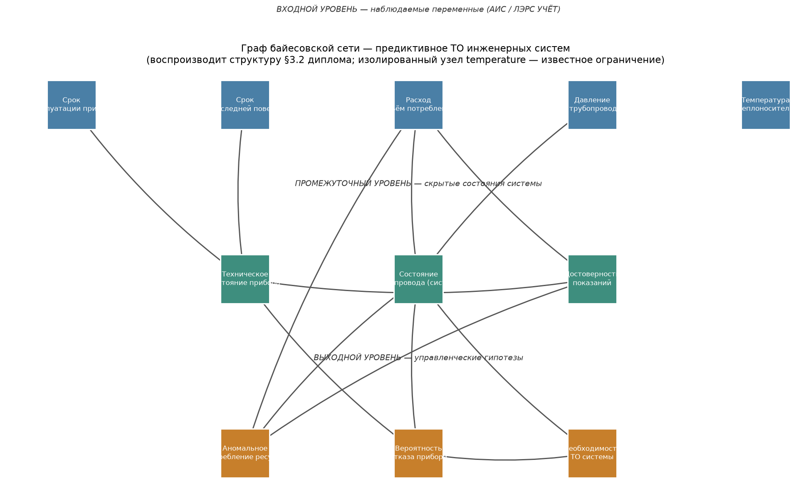

# Байесовская сеть доверия для предиктивного ТО инженерных систем

Система поддержки принятия решений: показания приборов учёта тепла и воды →
вероятностная оценка скрытого состояния оборудования → решение о выезде
бригады с учётом цены ошибки.

Python-реализация модели, защищённой как ВКР (Поповцев Н.О., СПбГЭУ, 2026,
науч. рук. — к.т.н., доц. Л.В. Виноградов). Оригинал выполнен в HUGIN
Researcher; здесь — та же сеть в виде воспроизводимого тестируемого кода, с
решающим слоем, анализом чувствительности, восстановлением структуры по
данным и сравнением с ML.

| | |
| --- | --- |
| Узлов / дуг / свободных параметров | 11 / 20 / 428 |
| Согласие с эталонными сценариями ВКР | RMSE 0.047, макс. отклонение 0.075, 9 чисел из 9 в допуске |
| Тестов / реализаций вывода | 47 / 3 независимые, сверяются между собой |
| CI | 2 джобы, ядро проекта работает без pgmpy |

| Ноутбук | О чём |
| ------- | ----- |
| [1. Сеть и валидация](notebooks/01_network_and_validation.ipynb) | Структура, сверка с ВКР, explaining away, чувствительность |
| [2. Решающий слой](notebooks/02_decision_layer.ipynb) | Матрица потерь, разбор решения, сравнение стратегий, ограниченная бригада |
| [3. Калибровка](notebooks/03_calibration.ipynb) | Разрыв в сценарии 3, поиск недостающей дуги, цена принятия гипотезы |
| [4. Обучение и baselines](notebooks/04_learning_and_baselines.ipynb) | Обучение параметров и структуры, сравнение с ML |

Ноутбуки собраны с выполненными выводами и графиками — открываются на GitHub,
запускать ничего не нужно.

---

## 1. Бизнес-контекст

ООО «Спецмастер», Республика Коми: обслуживание приборов учёта тепла и воды,
парк около 120 объектов в отопительный сезон. Модель обслуживания до
внедрения — реактивная: выезд по жалобе абонента или по превышению порога
расхода.

| Проблема | Следствие |
| --- | --- |
| Порог по расходу не различает утечку, засор и неисправность прибора | 6–8 ложных выездов в месяц |
| Отказ прибора виден только постфактум | 3 пропущенных отказа за квартал |
| Диспетчер узнаёт об аномалии из жалобы | реакция 24–72 ч |

Ложный выезд и пропущенный отказ стоят предприятию **разного**, и пороговое
правило этой разницы не видит: порог — одна точка на кривой компромисса,
выбранная без учёта цен.

**Пилот (реальные данные ВКР, не из этого репозитория).** АИС на базе
ЛЭРС УЧЁТ: 32 объекта, ежесуточный опрос, 97.8 % успешных сессий; поверх неё
аналитический слой на байесовской сети.

| Показатель | До | После |
| --- | --- | --- |
| Ложные выезды, в месяц | 6–8 | 1–2 |
| Пропущенные отказы, в квартал | 3 | ≤ 1 |
| Время реакции на аномалию | 24–72 ч | 2–6 ч |

Корректная формулировка: «после внедрения ложные выезды снизились с 6–8 до
1–2 в месяц». Некорректная: «модель снизила ложные выезды на 75 %» — вклад
модели не отделён от вклада самой АИС. Дизайн пилота — см. раздел 6.

---

## 2. Бизнес-решение

**Что предлагается.** Заменить пороговое правило на вероятностную оценку
скрытого состояния объекта плюс явную матрицу потерь.

**Ключевое управленческое отличие.** Решение «ехать или нет» выводится из
вероятности, умноженной на цену ошибки. Управляющий параметр один — **R:
во сколько раз пропущенный отказ дороже ложного выезда**. Остальное
считается.

| Что даёт | Как измеряется |
| --- | --- |
| Приоритизация заявок при одной бригаде | ранжирование по ожидаемой выгоде вместо очереди по срабатыванию порога |
| Осознанный выбор точки компромисса | `breakeven_ratio()` — при каком R решение меняется |
| Оценка полезности каналов телеметрии | ценность информации в единицах потерь: какой датчик окупается |
| Объяснимость | вывод предъявляет промежуточные гипотезы вместе с итоговой оценкой |

**Пример.** Сценарий «давление отклонилось, расход аномально высокий, прибор
среднего возраста»: срочный выезд окупается начиная с R ≈ 2.2. Ниже этой
границы дешевле включить объект в план ТО. Значение R задаётся снаружи и
пересчитывается под тарифы предприятия.

**С чем сравнивается.** Штатный блок диагностики нештатных ситуаций (НС) в
самой ЛЭРС УЧЁТ — не гипотетический конкурент, а функциональность, которой
предприятие уже владеет. Он анализирует часовые и суточные архивы, сравнивает
параметры с заданными пользователем диапазонами (раздельно для летнего и
зимнего режимов), умеет диагностировать недогрев и перегрев по среднесуточной
уличной температуре и ведёт журнал НС со связанными работами
([документация](https://docs.lers.ru/manual/analysis/incident-types.html)).

Это уставочная система: НС регистрируется при выходе параметра за диапазон.
Различия предлагаемого подхода — три. Скрытое состояние оценивается совместно
по нескольким входам, поэтому конкурирующие объяснения одного и того же
отклонения расхода разделяются («утечка» против «прибор врёт»). Выход
вероятностный, что позволяет ранжировать объекты между собой. Цена ошибки
задана явно, поэтому граница срабатывания выводится из тарифов, а не
настраивается вручную для каждой точки учёта.

**Границы продуктовой части.** Репозиторий сознательно ограничен
исследовательско-инженерным контуром: модель, эксперименты, валидация,
демонстрационный интерфейс. MVP — панель `app/streamlit_app.py`: ввод
показаний по объекту, апостериорные вероятности по трём выходам, рекомендуемое
действие с разбором ожидаемых потерь и границами R. Обратная связь получена от
одного эксперта предприятия и использована по назначению: два опроса привели к
изменению структуры сети, что зафиксировано в разделе 4.3. Полноценного
продуктового исследования — сегментации, интервью с несколькими диспетчерами,
юнит-экономики по тарифам предприятия — здесь нет, и результаты пилота
единственный доступный измеритель импакта.


---

## 3. Техническое решение

### 3.1 Архитектура сети

Трёхуровневая иерархия «данные → скрытые состояния → управленческие гипотезы».
Скрытый слой несёт основную нагрузку: он позволяет связать показания с
решениями через объяснимые состояния оборудования, минуя пороговые правила.

```
Вход (АИС)                Скрытые состояния            Выход (решения)
──────────────            ──────────────────           ────────────────────
давление      ──┬────────→ состояние прибора ──┬─────→ вероятность отказа ─┐
температура   ──┤     ┌──→ состояние трубопр. ─┼──┬──→ необходимость ТО ←──┘
расход        ──┴─────┤                        │  │
срок поверки  ────────┼──→ достоверность ──────┴──┴──→ аномальное потребл.
срок эксплуат.────────┘         показаний
```



11 узлов по 2–3 состояния, 20 дуг, 428 свободных параметров. Полное
пространство ≈ 79 000 комбинаций — для точного вывода перебором тривиально.
Точный список дуг — в `PARENTS` (`src/network_spec.py`, единственный источник
истины по структуре и CPT); схема выше передаёт уровни, без детализации
отдельных дуг.

**Структура пересмотрена относительно текстового описания ВКР.** Там узел
«температура» объявлен входом, но причинных дуг от него нет: анализ
чувствительности давал по нему размах отклика 0.0000 — канал АИС опрашивался
впустую. По опросу эксперта предприятия граф расширен с 13 дуг до 20,
обоснование каждой правки — в разделе 4.3.

**Норма температуры задаётся относительно.** Опорное значение берётся из
температурного графика по усреднённой за 12–24 ч уличной температуре, допуск
±3 % (ПТЭ тепловых энергоустановок, приказ Минэнерго России от 24.03.2003
№ 115). Допуск процентный: при 70 °C он даёт ≈ ±2.1 °C, при 130 °C ≈ ±3.9 °C.

### 3.2 Предобработка: от архивов приборов к признакам — `src/preprocessing.py`

Источник — база ЛЭРС УЧЁТ (PostgreSQL): часовые и суточные архивы по точкам
учёта плюс паспорта узлов. Модуль приводит их к пяти категориальным входам
сети.

**Схема источника вынесена в конфиг, а не зашита в код.** Набор параметров
зависит от модели прибора: тепловычислитель, термопреобразователь и датчик
давления отдают разное, состав узла учёта различается от объекта к объекту.
Соответствие столбцов ролям задаётся в `ColumnMap`, неотображённый параметр
даёт незаполненный признак и запись в отчёте о проблемах.

| Признак | Правило | Источник правила |
| --- | --- | --- |
| Температура | Отклонение подачи от температурного графика > 3 % | ПТЭ ТЭ, приказ Минэнерго № 115 от 24.03.2003 |
| Поверка | Дата последней поверки + межповерочный интервал; горизонт «приближается» — 90 дней | Паспорт узла |
| Срок эксплуатации | Годы с даты ввода: < 3, 3–7, > 7 | Паспорт узла |
| Давление | Паспортный диапазон, при его отсутствии — робастная оценка по истории объекта | Паспорт либо медиана и MAD |
| Расход | То же | Паспорт либо медиана и MAD |

Три решения, за которыми стоит специфика данных:

* **Опорная точка графика ищется по среднесуточной уличной температуре**,
  усреднённой окном 12–24 ч. Сравнение с мгновенным значением даёт шум вместо
  сигнала, потому что график задаёт режим на сутки вперёд.
* **Допуск процентный.** При 70 °C он даёт ≈ ±2.1 °C, при 130 °C ≈ ±3.9 °C.
  Фиксированный порог в градусах ложно срабатывал бы на низкой полке графика
  и пропускал отклонения на высокой.
* **Масштаб отклонений оценивается медианой и MAD.** Выборка по объекту
  короткая, а выбросы — это ровно то, что ищется, поэтому оценка масштаба не
  должна ими портиться.

**Пропуск остаётся пропуском.** Сеть принимает частичное свидетельство,
поэтому отсутствующий параметр передаётся как «неизвестно». Подстановка
«норма» вместо пропуска создала бы ложную уверенность там, где данных нет.
Значения вне физически возможного диапазона (сбой связи, ошибка пересчёта
единиц) отбрасываются, а не подрезаются по границе. Функция `coverage()`
показывает, какая доля объект-суток пригодна для вывода и каких признаков не
хватает.

**Известное упрощение.** Узел учёта — комплект: вычислитель,
термопреобразователи, преобразователь расхода, датчики давления. У каждого
компонента свой межповерочный интервал и свой срок службы, а в сети по одному
узлу `calibration` и `age`. Модуль берёт худший компонент комплекта: ближайшую
истекающую поверку и самый старый элемент. Разделение по компонентам
потребовало бы менять структуру сети.

### 3.3 Решающий слой — `src/decision.py`

`a*(e) = argmin_a Σ_s P(s|e)·L(a,s)` — действие, минимизирующее ожидаемые
потери, вместо `argmax` вероятности.

Синтетический парк 20 000 наблюдений, нормировка на 100 объектов. Данные
порождены **возмущённой** сетью: структура у политики верная, числа в CPT —
нет. Это положение реальной экспертной модели.

| Стратегия | Ложных срочных | Пропущено срочных | Средние потери |
| --- | --- | --- | --- |
| Реактивное правило (порог расхода) | 2.66 | 18.37 | 1.245 |
| БСД + argmax вероятности | 2.10 | 18.24 | 1.232 |
| **БСД + мин. ожидаемых потерь (R=5)** | 6.08 | **1.06** | **0.902** |

Правило `argmax` пропускает практически столько же срочных случаев, что и
грубый порог: оно экономит выезды за счёт пропусков, и без матрицы потерь это
не видно ни в accuracy, ни в F1.


Слева: каждая точка синей кривой — своя цена пропущенного отказа; оба
альтернативных правила лежат выше кривой, то есть доминируются. Справа: при
одинаковом бюджете выездов ранжирование по ожидаемой выгоде продолжает
снижать пропуски там, где пороговое правило упирается в потолок.

Дополнительно: `triage()` — ранжирование при лимите K выездов;
`breakeven_ratio()` — границы R, на которых меняется оптимальное действие;
`cost_ratio_sweep()` — вся кривая компромисса.

### 3.4 Чувствительность и ценность информации — `src/sensitivity.py`

Эталонные сценарии ВКР покрывают 3 комбинации входов из 108. Систематическая
проверка остальных: размах отклика, взаимная информация, ценность информации
в единицах ожидаемых потерь.

| Вход | Размах отклика | Взаимная информация, бит | VOI сверх остальных, у.е./объект |
| --- | --- | --- | --- |
| Расход | 0.793 | 0.116 | 0.0279 |
| Давление | 0.480 | 0.073 | 0.0270 |
| Срок эксплуатации | 0.227 | 0.025 | 0.0046 |
| Температура | 0.190 | 0.011 | 0.0025 |
| Срок поверки | 0.174 | 0.013 | 0.0036 |

Мёртвых входов нет. Модуль отвечает на вопрос «какой канал телеметрии стоит
своих денег» в тех же единицах, в которых считается решение.

### 3.5 Калибровка и структурная гипотеза — `src/calibration.py`

Реконструированная сеть расходилась с ВКР в одном месте: сценарий 3,
P(отказ = высокая) = 0.37 против 0.70.

**Улика.** В сценариях 2 и 3 состояние прибора одинаково, а P(отказ)
отличается вдвое; при этом в сценарии 3 трубопровод *вероятнее* исправен. При
двух заявленных родителях такое невозможно ни при каких CPT — у узла есть
родитель, отсутствующий в текстовом описании структуры.

Три гипотезы, CPT для каждой подбирается минимизацией
`Σ(p_модель − p_ВКР)² + λ·||logit − logit_эксперт||²`. Штрафное слагаемое —
суть метода: целевых чисел шесть, параметров 27–81, без штрафа подходит любая
гипотеза. Единственный информативный показатель здесь — **цена** подгонки.

| Гипотеза: родители `failure_prob` | RMSE к ВКР | Среднее искажение CPT |
| --- | --- | --- |
| A: прибор, трубопровод (как в тексте) | 0.062 | 0.124 |
| **B: прибор, трубопровод, расход** | **0.042** | **0.046** |
| C: прибор, трубопровод, достоверность | 0.059 | 0.104 |


Гипотеза B доминирует по обеим осям, принята и подставлена в модель.
Ограничения этого решения — в разделе 6. Прежняя
двухродительская реконструкция сохранена как `CPT_FAILURE_EXPERT` — точка
отсчёта для штрафа за искажение. Ограничения этого решения — в разделе 6.

### 3.6 Восстановление структуры по данным — `src/structure_learning.py`

Жадный поиск по BIC, чистый numpy.

| n | F1 по скелету | Полнота | Точность |
| --- | --- | --- | --- |
| 200 | 0.46 | 0.30 | 1.00 |
| 5000 | 0.74 | 0.65 | 0.87 |
| 20000 | 0.78 | 0.80 | 0.76 |

Направленная F1 остаётся низкой по принципиальной причине: по наблюдательным
данным структура восстановима лишь с точностью до класса
Марковской эквивалентности, направление дуги вне v-структуры неразличимо.
Основная метрика — скелет.

Слабые дуги (температура сдвигает распределения на единицы процентов) требуют
на порядок больше наблюдений, чем сильные. Это и есть аргумент в пользу
экспертного графа: он даёт то, чего данные такого объёма дать не могут.

### 3.7 Сравнение с ML — `src/baselines.py`

Два режима генерации данных; содержателен второй — из возмущённой сети, где
структура верна, а параметры нет. Метрики — правила скоринга (log-loss,
Brier): продуктом системы является вероятность, на которую умножается цена
ошибки, поэтому калибровка важнее попадания в класс.

Log-loss, меньше — лучше:

| n_train | DecisionTree | RandomForest | LogisticReg | GradBoosting | БСД экспертная | БСД обученная | Предел |
| --- | --- | --- | --- | --- | --- | --- | --- |
| 20 | 13.60 | 3.53 | 1.16 | 0.99 | **0.882** | 0.997 | 0.871 |
| 100 | 5.33 | 2.37 | 0.94 | 0.95 | **0.882** | 0.914 | 0.871 |
| 1000 | 1.29 | 1.22 | 0.89 | 0.91 | 0.882 | **0.873** | 0.871 |
| 10000 | 0.93 | 0.90 | 0.88 | 0.88 | 0.882 | **0.870** | 0.871 |


**Вывод:** основной выигрыш в объёме данных даёт экспертный
причинно-следственный граф. Он резко сокращает число оцениваемых параметров и
обгоняет модели без структуры на всём диапазоне, тогда как экспертные значения
самих вероятностей вторичны. На выборках до ~1000 наблюдений
лучший результат дают экспертные CPT — это цена богатой структуры (428
параметров вместо 146) и одновременно аргумент в пользу опроса эксперта.

---

## 4. Реализация и обоснование решений

### 4.1 Стек и проверяемость

| Решение | Почему |
| --- | --- |
| Ядро на numpy, без фреймворка БС | Точный вывод перебором по 79 000 комбинаций тривиален; полный контроль над кодом, который должен воспроизводиться через год |
| Три независимые реализации вывода | Взаимная проверка: ошибка в CPT или структуре ломает совпадение до того, как доедет до выводов |
| `pgmpy==1.1.2`, версия закреплена точно | В ветке 1.x переименована часть API; диапазон означал бы поломку сборки в произвольный момент |
| Обучение структуры не на pgmpy | BIC для дискретной сети раскладывается по узлам и умещается в сотню строк numpy — надёжнее, чем зависеть от переименований |
| Ноутбуки как артефакт сборки | Повествование живёт в `notebooks/sources/*.py`; `.ipynb` собирается скриптом вместе с выводами — читаемые диффы вместо JSON-каши |

`reference_inference.py` (перебор по независимо собранным CPT), `model.py`
(тензорный движок) и `network.py` (pgmpy) обязаны давать одинаковые ответы.
Сверка — на всех 108 комбинациях входных свидетельств, расхождение 0.

### 4.2 Происхождение чисел

Полные CPT из исходного файла HUGIN в тексте ВКР не приведены, поэтому часть
таблиц — реконструкция.

| Что | Статус |
| --- | --- |
| Структура сети | Текст ВКР + восстановление недостающих дуг по опросу эксперта |
| CPT «состояние прибора» при давлении и температуре в норме | **Точно из ВКР** |
| CPT «состояние трубопровода» при температуре в норме | **Точно из ВКР** |
| Поправки на давление и температуру | Экспертные коэффициенты, подтверждены на опорных строках |
| Правило «достоверность показаний» | Экспертное; модель комбинирования — noisy-max |
| CPT «достоверность», «необходимость ТО», «аномальное потребление» | Реконструкция, валидирована по эталонным сценариям |
| CPT «вероятность отказа» | **Подогнана** под 6 чисел ВКР (гипотеза B) — см. раздел 6 |
| Априорные вероятности входов | Допущение для симуляции |
| Матрица потерь | Иллюстративная параметризация, не тарифы предприятия |
| Данные пилота (32 объекта) | Не публикуются (собственность предприятия); везде далее синтетика |

Модель пропорциональных шансов подобрана так, что «новый родитель в норме»
возвращает ровно строку из ВКР — исходные таблицы сохранены бит-в-бит.

### 4.3 Обоснование правок структуры

| Правка | Основание |
| --- | --- |
| Температура → состояние прибора и трубопровода | Опрос эксперта; до правки узел не влиял ни на один выход |
| Давление → состояние прибора | Опрос эксперта: один из главных параметров |
| Поверка, срок эксплуатации → достоверность показаний | Опрос эксперта |
| Состояние прибора, достоверность → необходимость ТО | Опрос эксперта: решение опирается на историю прибора помимо вероятности отказа |
| Расход → аномальное потребление, ослаблена вдвое | Арифметика: при родителях {трубопровод, достоверность} потолок P(утечка) = 0.653 < 0.67 из ВКР при любых CPT — значит, вход помимо трубопровода существовал |
| Дуга «трубопровод → достоверность» снята | Расхождение в терминах: узел означает «прибор исправно измеряет», эксперт отвечал про «показания отражают реальное потребление». Второе описывает узел «аномальное потребление» — потомок гидравлики в графе |

Последняя правка — методически показательная: расхождение не ловилось сверкой
с эталонными числами, только вопросом «что этот узел означает». Формулировки
состояний согласуются с экспертом до опроса о вероятностях.

### 4.4 Тестирование и CI

Проверяется: сверка с эталонными сценариями (9 чисел, допуск 0.10); взаимная
сверка трёх движков на 108 комбинациях; 47 модульных тестов; smoke-тест
Streamlit-приложения на заглушке UI; выполнение всех ячеек ноутбуков — ловит
рассинхрон кода и повествования.

Джоба CI `core` ставит всё, кроме pgmpy, и тем доказывает независимость ядра.
Джоба `full` падает, если pgmpy-тесты были **пропущены**, а не выполнены — это
защита от зелёного бейджа, означающего «прошли только numpy-тесты».

---

## 5. Использование AI-инструментов

**Что было до кода.** Постановка задачи, бизнес-контекст, выбор байесовской
сети как метода и работающая модель в HUGIN Researcher — результат ВКР,
выполненной без AI-инструментов. Причинно-следственный граф, состояния узлов и
эталонные сценарии Табл. 3.6 пришли оттуда.

**Что сделано с Claude Code.** Проектирование архитектуры репозитория и
основной объём кода: тензорный движок вывода, решающий слой, модули
чувствительности и калибровки, восстановление структуры, сравнение с ML,
тесты, CI, ноутбуки. Работа шла многими сессиями в агентном режиме — модель
читала репозиторий, правила несколько файлов за проход и прогоняла проверки.

**Исследовательские задачи, где вклад был содержательным:**

| Задача | Результат |
| --- | --- |
| Аудит структуры по схеме сети | Выявлен изолированный узел «температура» и составлен полный список дуг для сверки с экспертом |
| Подготовка опроса эксперта | Вопросы разбиты по блокам CPT с готовыми числами для подтверждения вместо открытых формулировок; 464 параметра сведены к ~20 экспертным величинам через модель пропорциональных шансов |
| Разбор расхождения со сценарием 1 | Найден арифметический потолок 0.653 < 0.67, доказавший существование недостающей дуги |
| Ревью кода | Обнаружена круговая постановка в решающем слое и лимит `MAX_PARENTS = 3` при графе с четырьмя родителями |
| Анализ мощности | Оценка объёма данных для подтверждения структурной гипотезы: ~800 наблюдений |

**Где решения принимал человек и как проверялись предложения модели.**
Все изменения структуры проходили через опрос эксперта предприятия: модель
формулировала вопросы, эксперт отвечал, решение фиксировалось после ответа.
Численные предложения проверялись прогоном против Табл. 3.6.

Пример отсева: для влияния недостоверных показаний на необходимость ТО модель
предложила трактовку «повод для планового выезда». Прогон дал RMSE к эталону
хуже исходной версии кода (0.124 против 0.089), вариант отклонён; принят
третий, подтверждённый экспертом отдельно. Такие проверки — причина, по которой
в репозитории три независимые реализации вывода и сверка с эталоном в CI:
сгенерированный код нуждается в независимом критерии корректности, и критерий
здесь внешний по отношению к самому коду.

---

## 6. Ограничения

Перечислено то, что модель **не** доказывает.

**Согласие по узлу «вероятность отказа» тавтологично.** Его CPT подогнана под
те самые шесть чисел, с которыми её потом сверяет `verify_reference.py`: для
этого узла скрипт работает как регрессионный тест: ловит случайную порчу
таблицы, но независимой проверкой уже не является. По двум другим выходным
узлам проверка сохраняет силу — их таблицы не подгонялись и воспроизводят
эталон в пределах 0.075.

Что подгонкой не куплено: сравнение гипотез между собой (одинаковое λ и число
уравнений) и поведение таблицы там, где сценарии молчат — все девять строк с
низким расходом совпали с экспертной реконструкцией до четвёртого знака.

**Искажение сосредоточено в нескольких строках.** 0.046 — среднее по всей
таблице. В строках с аномально высоким расходом, определяющих эталонные
сценарии, отдельные вероятности сдвинулись почти на 0.60.

**Все прогоны в репозитории — синтетика.** Реальные данные пилота не
публикуются. Абсолютные уровни выездов и пропусков завышены: априорные
вероятности входов — допущение, а не измеренные частоты. Сравнение стратегий
между собой при этом корректно, все работают на одной базе.

**Пилот проведён без контрольной группы**, на 32 объектах за два месяца,
частично ретроспективно.

**Открытые вопросы.**

| Что | Что для этого нужно |
| --- | --- |
| Подтвердить гипотезу B данными | Наблюдаемый исход отказа: сейчас состояния узла описывают оценку риска, тогда как сверять нужно факт события. Плюс акты обследования с найденным состоянием прибора и трубы. Анализ мощности: ~800 наблюдений, около одного отопительного сезона на парке в 120 объектов |
| Заменить априорные вероятности измеренными | Выгрузка из АИС; `python -m scripts.fit_priors выгрузка.csv`. Эталонные сценарии от замены не изменятся (проверено: сдвиг 1.5e-15), изменятся все величины, усредняющие по парку |
| Заменить реконструированные CPT точными | Доступ к исходному файлу HUGIN |

---

## Структура репозитория

```
├── src/
│   ├── network_spec.py         # структура + CPT — единственный источник истины
│   ├── preprocessing.py        # архивы приборов → категориальные признаки
│   ├── model.py                # движок БС: тензорные CPT, вывод, обучение
│   ├── reference_inference.py  # независимый оракул: перебор, только numpy
│   ├── network.py              # pgmpy-модель (третья реализация)
│   ├── decision.py             # матрица потерь, политики, triage
│   ├── sensitivity.py          # торнадо, взаимная информация, VOI
│   ├── calibration.py          # подгонка CPT, проверка структурной гипотезы
│   ├── structure_learning.py   # жадный поиск по BIC
│   ├── learning.py             # обучение параметров через pgmpy
│   ├── data_generator.py       # синтетика (ancestral sampling)
│   ├── baselines.py            # сравнение с ML, два режима
│   └── visualization.py        # граф сети
├── notebooks/{0*.ipynb, sources/*.py}   # собранные ноутбуки + их исходники
├── scripts/{verify_reference, build_notebooks, fit_priors, eda_report}.py
├── tests/                      # 47 тестов, 5 модулей
├── app/streamlit_app.py
└── requirements.txt / Dockerfile / .github/workflows/ci.yml
```

## Запуск

```bash
pip install -r requirements.txt

pytest -v                          # тесты (ядро не требует pgmpy)
python -m scripts.verify_reference # сверка с эталонными сценариями ВКР
python -m src.decision             # стратегии, ограниченная бригада, разбор решения
python -m src.sensitivity          # чувствительность, ценность информации
python -m src.calibration          # калибровка и структурная гипотеза
python -m src.structure_learning   # восстановление структуры по данным
python -m src.baselines            # сравнение с ML
streamlit run app/streamlit_app.py # интерактивная демонстрация

docker build -t bsd-maintenance . && docker run -p 8501:8501 bsd-maintenance
```

Остальные точки входа (`src.learning`, `src.data_generator`,
`src.visualization`, `scripts.eda_report`, `scripts.build_notebooks`,
`scripts.fit_priors`) — там же, по тому же шаблону.

## Лицензия

MIT, см. `LICENSE`. Исходная научная работа — Поповцев Н.О., ВКР, СПбГЭУ, 2026.
